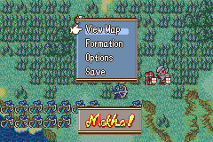

# FE8U Custom Object insert hack by Mokha

A test to insert own OAMs.

You just need to take `FE8U-CustomObj.event` through EA.

For debug, you will see "Mokha" blinking on screen when view map-menu on PrepScreen.

* For Compile:
see https://github.com/StanHash/FE-CHAX.git, and https://github.com/MokhaLeee/FE8U-cSkillSystem.git
